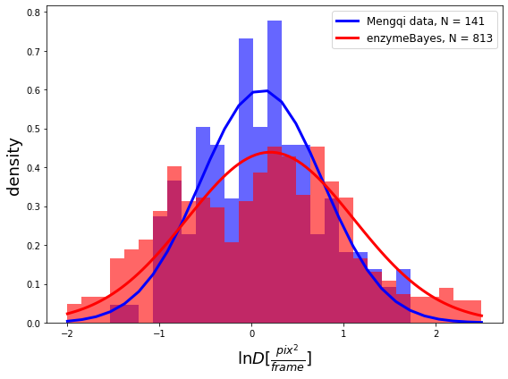

# enzymeBayes 



Final project repository for Jiayu Zhang and Kiran Gauthier for 
[Machine Learning with Probabilistic Programming](http://www.proditus.com/mlpp2020).


## Final Project Notebook

The final project notebook can be found under `/final-project/final-notebook.ipynb`. All model specifications can be found in the `/final-project/helper_file.ipynb` notebook and all helper functions for plotting and analyzing data can be found in the `/final-project/enzyme_utils_hpw.py` file. 

## Development
Once you activate the virtual environment to run this project, you can use `pip` to install the necessary 
packages.
```{bash}
(venv)$ pip install -r requirements.txt
```

You should see a message at the end that resembles something like
```
Successfully installed appnope-0.1.0 ...
```
